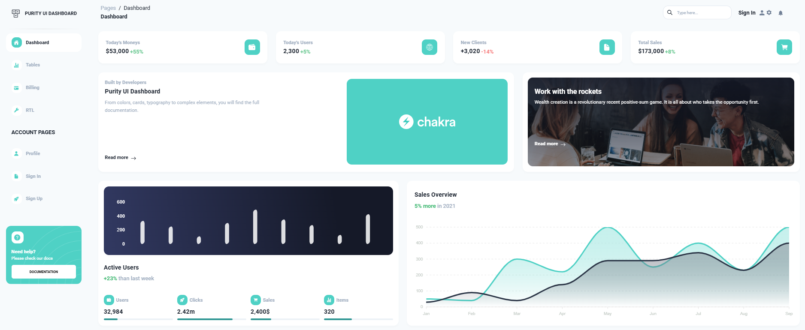
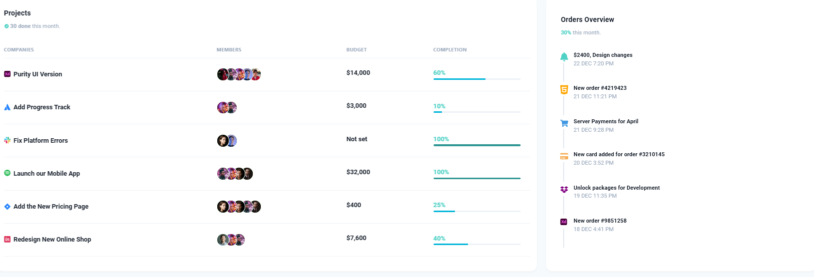
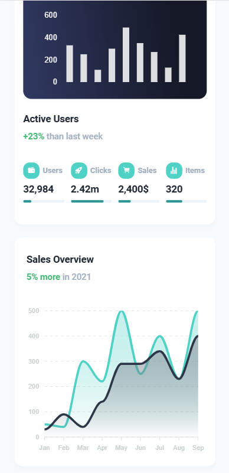

# 📸 Image Gallery

Here are some images related to the project. These images are stored in the `assets` folder of the project.

### 🖥️ Desktop View

The above image shows the landing page of the application in desktop view. It highlights the clean design and layout, focusing on key metrics and user interactions.

### 📊 Table View

This image demonstrates the table view of the application, showcasing the data presentation in a structured format for easy viewing and management.

### 📱 Small Device Responsive View

This image shows how the application adapts to small devices like mobile phones. It provides a responsive design that ensures usability on different screen sizes, offering a seamless user experience.
